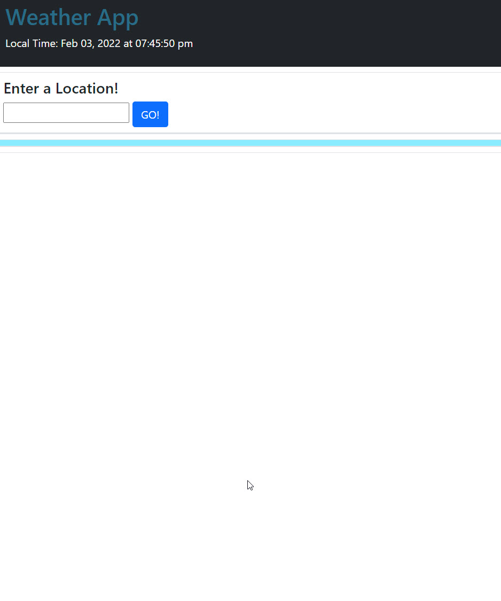
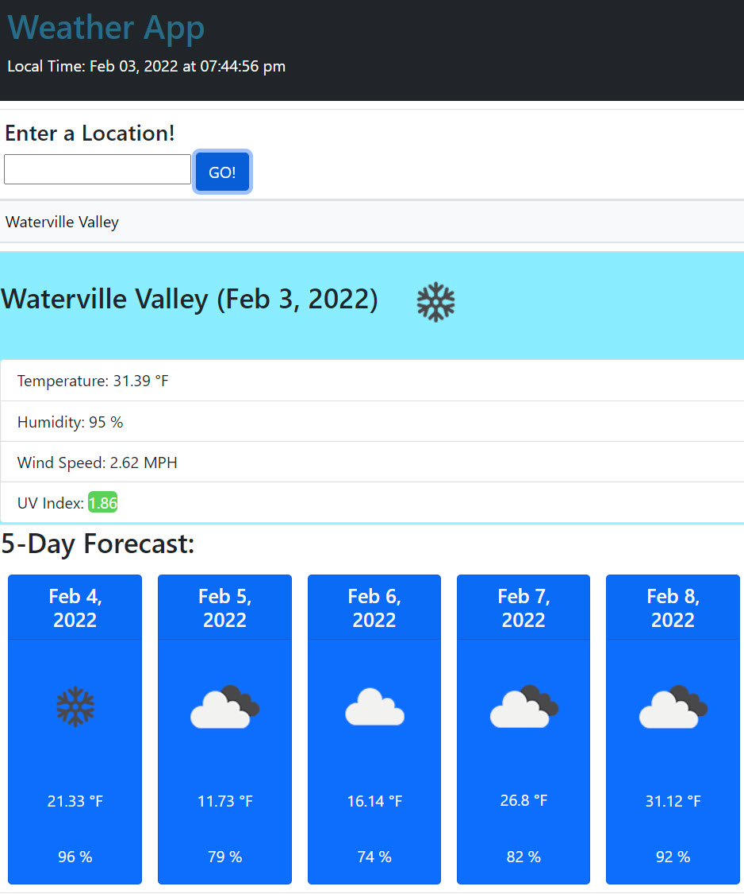

# Homework-Week6
This is a weather dashboard application that uses Server-side API's to populate and refresh data.

Title: Javascript Quiz
Author: Bobby Schwartz
Description: This is a weather dashboard application that uses Server-side API's to display weather data. Dynamically created HTML then displays the information.

completed: 2/3/21

===============================

## Details
This app displays current weather for a searched city via the OpenWeatherMap API. Information displayed includes temp, humidity, wind, UV index, and a 5 day forecast.

This uses the fetch function and then creates HTML populated with JSON data from the API Call.
past searches are saved as an array that gets appended with each new search. this is sent to local storage as a string JSON object that can be used later to render buttons that call the needed weather functions all over again.

### Screenshots

The initial landing page has only the base search field:

But when a city is submitted: document.createElement, .classList and appendChild is used display the JSON data of the API Call with additional text:

setAttribute and `${weather.weather[0].icon}` is used to enable OpenWeatherMap icons to pull through.

### Active link:
The deployed application can be viewed here:
https://robertschwartz603.github.io/Homework-Week6/

